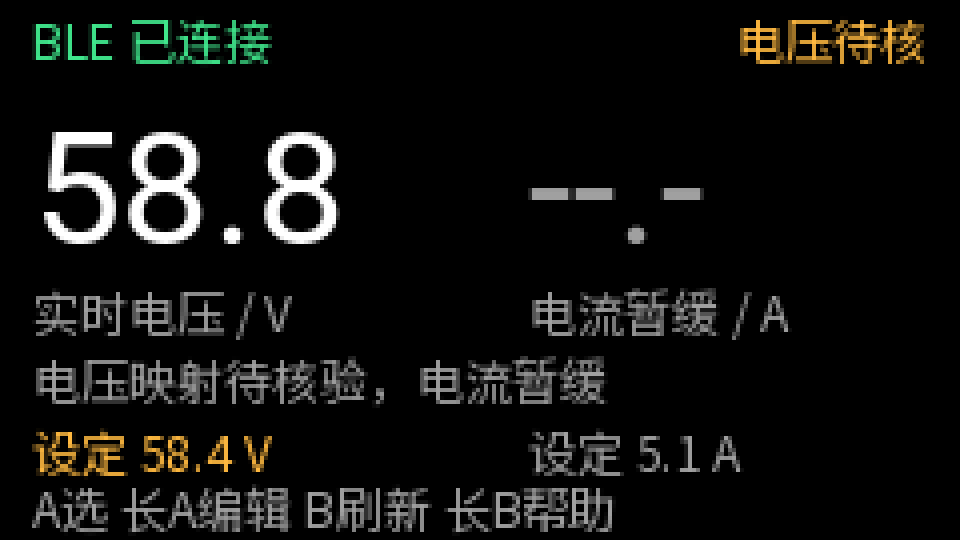
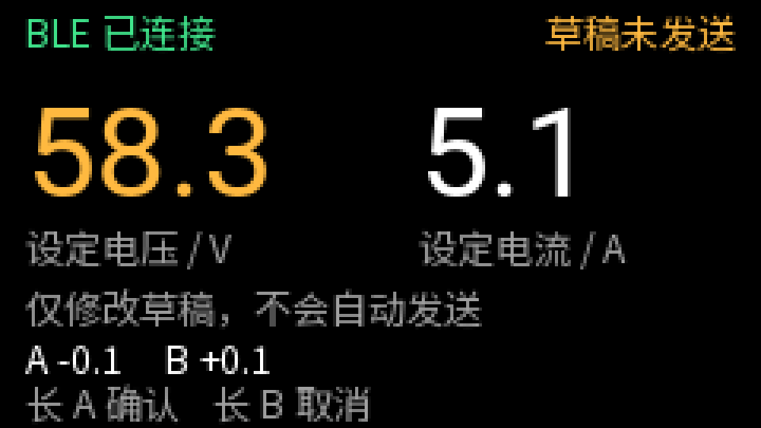
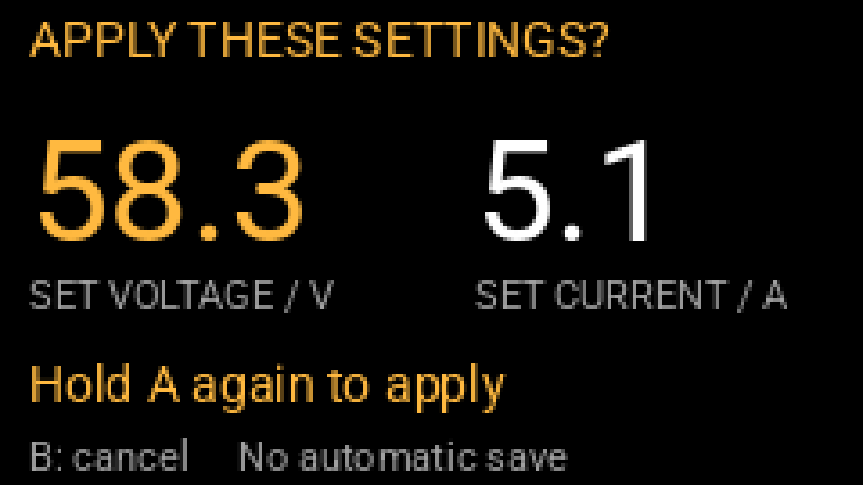
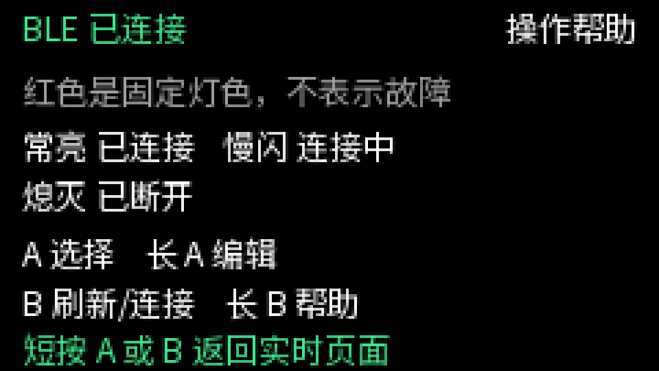
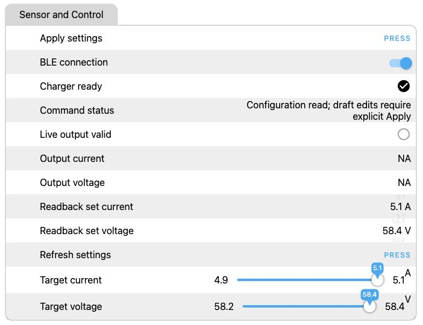
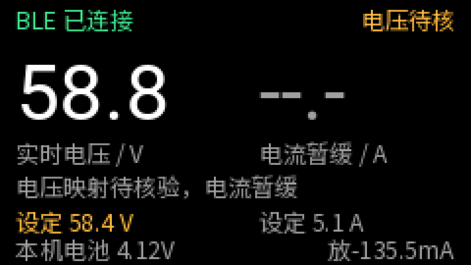
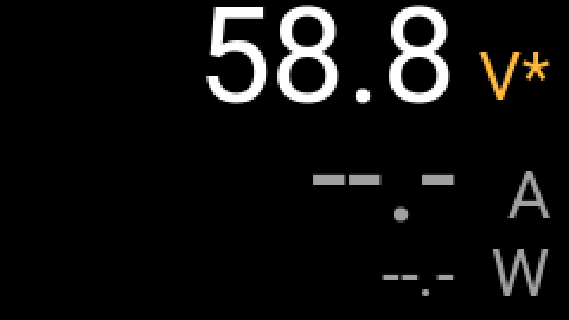

# LXY BLE Charger · ESPHome

[English](README.md) | **简体中文**

基于 **ESPHome 2026.9.0 + ESP-IDF** 的 LXY BLE 充电器控制器。BLE 与事件总线是必选核心，LCD、实体按键、LED、独立网页、本机电池监测是五个可选模块。使用网页时不需要 Home Assistant 服务器；不选网页时，BLE 仍可独立连接并读取参数。

项目支持已验证的 `FFF0` 服务、`FFF2` 写入、`FFF1` 通知协议。相同品牌或设备名称不代表协议一定兼容。LCD 主区域用于显示**输出电压、电流**，**充电设定值**以较小字体单独显示。输出数据缺失或过期时显示 `--.-`，绝不用设定值代替测量值。**已启用推定的实时电压解析**：`84` 的 DATA[3:5] 按大端整数除以 10。重启抓包支持这一解释，但尚未与原小程序或万用表交叉核验，屏幕标注“电压待核”。**实时电流解码按用户要求暂缓**，保持 `--.-` / `NA`，设定电流调节仍可用。尚未实现温度解析或充电输出开关。

## 界面截图

### LCD 布局预览

下列预览由**与固件相同的 C++ 视图模型**生成，**不是硬件照片**。[渲染工具](tests/render_lcd.py) 使用 Pillow 绘制字体，个别像素可能与设备不同。

<p>
  
  
  
  
</p>

依次为输出页、编辑页、确认页和设备内帮助页。输出页使用抓包字节对应的 **58.8 V** 作为解析布局示例，电流保持未知；这不是经校准的实测值，也不是实体 LCD 照片。编辑与确认采用 **58.3 V / 5.1 A 示例草稿**，不是实际输出测量截图。中文顶栏分别说明 BLE 连接状况与输出数据状态。

其他界面测试场景：[数据不可用](docs/images/lcd-unavailable-preview.png)、[合成实时值](docs/images/lcd-live-simulation.png)、[合成过期数据](docs/images/lcd-stale-simulation.png)、[断开连接](docs/images/lcd-disconnected-preview.png)。合成的 53.8 V / 4.9 A 仅用于测试显示，不是充电器实测结果。

### 实机 Web 界面



截图来自 OTA 后运行新版界面固件的 M5StickC Plus。只读本地代理保留设备原始页面与实时事件数据，未模拟或替换读数；图片仅裁去 IP 等诊断信息。`BLE status` 单独报告连接状态，`Output data status` 明确标注电压映射为推定、电流不可用。设定回读仍为 **58.4 V / 5.1 A**。`Live output valid` 仅表示所声明的电压通道样本有效且未过期，不代表已经校准，也不代表电流可用。

## 选择配置

| 入口 | 硬件 | 默认模块 |
|---|---|---|
| [esp32-minimal.yaml](esp32-minimal.yaml) | 带 BLE 的经典 ESP32，4 MB Flash | BLE + 事件总线 |
| [esp32-headless.yaml](esp32-headless.yaml) | 带 BLE 的经典 ESP32，4 MB Flash | 核心 + Web |
| [atoms3u.yaml](atoms3u.yaml) | M5Stack ATOMS3U，ESP32-S3，8 MB Flash | 核心 + Web |
| [m5stickc-plus.yaml](m5stickc-plus.yaml) | 原始 M5StickC Plus / v1.1，ESP32-PICO-D4、AXP192 | 核心 + LCD + Button + LED + Web + Battery |

M5StickC Plus 的硬件包不适用于 Plus2。ATOMS3U 配置不包含屏幕；普通 ESP32 板也不能直接套用 M5StickC 的引脚。ESP32-S2 没有 BLE，不适用本项目。[M5StickC Plus 官方硬件说明](https://docs.m5stack.com/en/core/m5stickc_plus)、[ATOMS3U 官方硬件说明](https://docs.m5stack.com/en/core/AtomS3U)。

M5StickC Plus 1.1 的 LED、LCD 和串口安装流程也参考同作者的 [m5stickplus1.1 项目](https://github.com/chinawrj/m5stickplus1.1)，并在此适配为 ESPHome 可选模块。

可选模块通过入口 YAML 的 `packages` 组合；始终保留 `common`：

```yaml
packages:
  common: !include packages/common.yaml
  web: !include packages/web.yaml
  lcd: !include packages/m5stickc-plus-display.yaml
  buttons: !include packages/m5stickc-plus-buttons.yaml
  led: !include packages/m5stickc-plus-led.yaml
  battery: !include packages/m5stickc-plus-battery.yaml
```

删除对应的一行即可省去该模块及其资源。上面四个 M5StickC 硬件包仅用于对应开发板。LCD、Button、LED、Web、Battery 之间没有互相调用；它们只通过事件总线交换请求和状态。详见[架构与事件契约](docs/architecture.md)。

## 编译与首次使用

需要 Python、C++ 构建工具和首次下载 ESPHome/ESP-IDF 依赖的网络连接。在项目目录执行：

```sh
python3 -m venv .venv
source .venv/bin/activate
pip install -r requirements.txt
cp secrets.example.yaml secrets.yaml
```

编辑 `secrets.yaml`，填入自己的 `charger_mac`。BLE 配置通过 `mac_address: !secret charger_mac` 引用它；启用 Web 时还需填写示例中的 Wi-Fi、热点、网页和 OTA 凭据。`secrets.yaml` 与生成固件不纳入版本管理，生成固件可能包含这些凭据。

选择一个入口文件进行校验、编译和 USB 上传，例如：

```sh
esphome config esp32-headless.yaml
esphome compile esp32-headless.yaml
esphome upload esp32-headless.yaml --device /dev/cu.YOUR_PORT --upload_speed 115200
esphome logs esp32-headless.yaml --device /dev/cu.YOUR_PORT
```

换用其他板时替换 YAML 文件名和实际串口。初次上传会替换开发板原固件；使用 ESPHome `upload` 处理正确的镜像与地址。纯核心配置没有 Wi-Fi/OTA，使用 USB 上传和查看日志。[ESPHome CLI 文档](https://esphome.io/guides/cli/)。

让手机小程序先断开充电器。开发板启动后连接指定设备，发现特征、订阅通知并读取设定值；这些步骤不会发送设置命令。

## 使用可选模块

### Web

优先连接 `secrets.yaml` 中配置的 Wi-Fi，通过板子的局域网 IP 访问页面。连接失败后可使用设备配网热点，打开 `http://192.168.4.1/` 并用自己的网页凭据登录；`/wifi` 是配网页。页面资源存储在设备内，不依赖外部 CDN；未启用 Home Assistant 原生 API。纯核心配置没有该网页或热点。

| 网页项 | 含义 |
|---|---|
| `BLE status` | 蓝牙已连接、连接中或断开，与输出解码独立 |
| `Output data status` | 输出数据实时、未解码、等待、无效或过期 |
| `Charger ready` | GATT 已就绪，并已取得本次连接的设定值 |
| `Output voltage/current` | 电压来自推定的状态解析；电流未知，不按空载推断为零 |
| `Live output valid` | 是否存在不足 6 秒的有效输出样本 |
| `Readback set voltage/current` | 设备回读的设定值 |
| `Target voltage/current` | 本地草稿，编辑不会向 BLE 发送设置 |
| `Apply settings` | 显式提交两项草稿值 |
| `Refresh settings` | 只读查询设定值 |
| `BLE connection` | 管理蓝牙连接，不是充电输出开关 |
| `Command status` | 请求接受、回读验证、拒绝或结果未知等状态 |

可设置范围为 **50.0–93.0 V / 1.0–10.0 A**，步长 **0.1**。电压范围依据用户提供的充电器铭牌（50–93 V），电流铭牌据用户报告为 3–10 A，软件按用户明确要求放宽至 1–10 A，低于 3 A 的设备接受情况尚未实测。全部 431 个电压档位及 91 个电流档位均通过编码、校验及模拟回显/回读测试；实际设备的设定回读验证仍仅覆盖 58.2–58.4 V。放宽范围不会自动改写当前设定。

### LCD

正常页用最大的 **40 px 字体**显示输出电压、电流，较小的“设定”数值表示配置值。左上角 BLE 连接状态与右上角数据状态始终独立：

| 屏幕文字 | 含义 |
|---|---|
| `BLE 已连接` | 蓝牙链路已经建立，但不代表输出读数一定可用 |
| `BLE 连接中` | 正在搜索、连接或重连 |
| `BLE 已断开` | 当前无连接，且连接尝试已关闭 |
| `电压待核` | 显示推定映射解析的实时电压，电流暂缓 |
| `实时` | 非推定数据源提供不足 6 秒的有效样本 |
| `未解码` | 链路可用，但尚未支持输出数据解码 |
| `已过期` | 之前的有效样本已达到 6 秒，隐藏旧的大数字 |

另有一行解释初始化、数据不可用/无效或最近的本地操作结果。当前电压解码器显示新鲜状态读数，同时标注**“电压待核”**和**“电压映射待核验，电流暂缓”**。电流仍未知；空载并不足以证明实测电流是 **0.0 A**。

界面绝不用设定值代替输出读数，断连后会使测量值失效。电压字节映射是依据重启抓包的明确推定，物理准确性尚待交叉核验；布局预览和合成遥测测试只验证软件行为，具体见对应版本的[验证记录](docs/verification.md)。

屏幕不放置 IP、品牌或温度，底部显示当前可用的按键动作。设备与预览共享 `charger_display` 视图模型。

### 按键

长按指**按住 800 ms 至 5 秒后释放**。达到阈值时屏幕会提示松开；仅按到 800 ms 并不会提交操作。超过 5 秒的按住会作为异常长按忽略。

| 模式 | A 键 | B 键 |
|---|---|---|
| 查看 | 短按：选择电压/电流。长按：进入编辑。 | 短按：已就绪时刷新；断开且连接尝试已关闭时申请连接一次。长按：打开帮助。 |
| 编辑 | 短按：当前草稿减 0.1。长按：进入确认。 | 短按：当前草稿加 0.1。长按：取消。 |
| 确认 | 再进行一次独立长按，才将两项草稿成对提交一次。 | 正常短按或长按均取消。 |
| 帮助 | 短按：只返回输出页，不切换选中项。 | 短按：只返回，不刷新、不发起连接。 |

连接或操作尚未完成时，重复按键不会提交新请求。帮助页直接说明红灯与按键含义；帮助页内长按没有操作，30 秒无输入后自动返回。

编辑和帮助需要可用 LCD。没有 LCD 时，Button 包仍可选择字段、连接和只读刷新，但不能编辑设定或 Apply。进入编辑和进入确认都不会发送设置命令；确认页同时展示两项草稿与原始回读值。

草稿限制为 **50.0–93.0 V / 1.0–10.0 A**，步长 **0.1**。**30 秒**无操作、断连、其他操作使设备忙碌、基准配置变化或显示不可用时，编辑自动取消。取消的草稿不会提交，也不会在稍后重放。

本地反馈明确区分“参数已刷新”“设置已确认”和“已取消，未发送”；无法确认结果时显示**“结果未确认，未重发”**。普通提示显示 3 秒；操作失败、结果未知和连接失败提示显示 6 秒，随后自动消退，不会改变红灯含义。按键通过事件通信，不直接调用 BLE 服务。

**按键空闲 5 分钟后关闭背光和状态 LED**（LED 为零占空比，不保留闪烁），计时跨越首页和功率页。按 A 或 B 恢复背光、BLE 灯态并返回首页，整次唤醒手势不会刷新或设置参数。BLE、Wi-Fi、电池采样和显示心跳继续运行。编辑、帮助、按住按键或等待操作结果时保持亮屏；未启用 Button 的配置保持常亮。

### M5Stick 本机电池

主页底部显示 **M5Stick 自身电池**：电压保留两位小数，电流使用带方向的 mA。
`充 +...mA` 表示充电，`放 -...mA` 表示放电；满电或无净电流时可能为 `0.0mA`，
不会仅凭 USB 已连接就判断正在充电。读取失败或数据过期显示 `--`，未检测到电池单独提示。
它与外接 BLE 充电器的数据独立，不代表外接充电器的实时电流已解码。
按住按钮时底栏优先显示操作提示，W/V/A 专属页保持不变。



上图使用合成数值演示布局，不是实机读数。
[充电布局预览](docs/images/lcd-battery-charging-preview.png) ·
[驱动、寄存器来源与事件说明](components/m5stick_battery/README.md)。

### 待机仪表页

同时启用 LCD 和 Button 时，**主页 15 秒没有按键操作**，自动进入专属仪表页：功率使用 **76 px 大字**作为主体，电压、电流用 28 px 字体并排放在底部一行；较长的功率数字会缩小以避免溢出，只保留三项读数和单位。按 A 或 B 返回主页；唤醒的整次手势会被消费，不会同时刷新、连接、编辑或提交。编辑、确认、帮助、请求未完成及按住按键时不会切入仪表页。仅有 LCD、没有 Button 的配置继续显示主页。

功率使用**同一份新鲜实时样本的电压 × 电流**，不使用设定值。目前仅解析电压，电流和功率均显示 `--.-`；断连、数据无效或过期也显示 `--.-`。琥珀色 `V*` 表示电压映射仍待核验，回到主页可查看完整 BLE 和数据状态。



[三项数据模拟预览](docs/images/lcd-meter-simulation.png) 使用合成值演示功率计算，不是设备实测数据。

### LED

**LED 的物理颜色就是红色，红色本身不表示故障。** 它只承担一个用途：显示 BLE 连接状态。

M5StickC Plus 指示灯采用 1 kHz PWM，亮起时限制为 **10% 占空比**，降低刺眼程度。可在 `packages/m5stickc-plus-led.yaml` 中调整 `max_power`；下方连接提示节奏不变。

| 指示 | 含义 |
|---|---|
| 常亮 | 蓝牙已连接，包含初始化或处理操作期间 |
| 慢闪：亮 500 ms、灭 500 ms | 正在搜索、连接或重连 |
| 熄灭 | 无连接，且连接尝试已关闭 |

亮屏时，**亮是已连接，闪是连接中，灭是已断开**。未解码、数据过期、事务忙碌与操作结果都不会覆盖这一节奏，细节看屏幕或 Web 状态。正常页长按 B，可以直接在设备上查看这份说明。

空闲省电期间，LED 会随背光一起熄灭，即使 BLE 仍连接；唤醒后恢复上述 BLE 指示。此模式不让 ESP32 深度睡眠，BLE、Wi-Fi 与采样持续运行。

## 设置确认与断线行为

每次 Apply 只发送一次 `03` 设置帧，等待参数一致的 `83` 回显，再发新的 `02/01` 查询，并用 `82` 回读核对电压、电流。`ACCEPTED` 只表示请求开始处理，`VERIFIED` 才表示此流程中的读回验证完成。`83` 回显本身没有独立成功码。

后台状态查询也使用同一串行通道：`04` 等待 `84` 时，可保留一笔带请求 ID 和固定参数快照的查询或 Apply，收到状态回复后才发送。后台轮询本身不会阻止编辑本地草稿。

超时或设置过程中断线会报告失败或结果未知，并清理连接状态；不会自动重发设置。启动、重连、查询、网页加载都不会自动 Apply。网页草稿在 BLE 重连后保留，控制器重启后从首次有效回读初始化。协议没有验证断电保存，因此不把回读匹配解释为永久保存或实际充电输出已改变。尚未实现充电输出开关。详见[协议参考与边界](docs/protocol.md)。

## 测试与验证范围

测试分为三个层次：

| 层次 | 覆盖内容 | 不能证明的事项 |
|---|---|---|
| 原生 C++ 测试 | 抓包帧编解码；队列、关联 ID、快照失效；32 种模块组合的模拟事件路由 | 实际无线通信、引脚和屏幕效果 |
| ESPHome 配置与固件矩阵 | 固定必选 BLE+bus，遍历 LCD/Button/LED/Web/Battery 的全部 `2^5 = 32` 种 M5StickC 组合；另编译 ATOMS3U | 已把所有组合逐个刷到硬件 |
| 实机验证 | 新版 M5StickC Plus 中文 LCD、按键响应、红灯常亮：**用户现场确认通过**。历史固件的无 LCD + Web 和完整配置：BLE 读取、显式 Apply 写值回读及重连测试通过 | ATOMS3U 实机与新版界面的实体 Apply 写入测试：**尚未验证**；按键响应确认不等同于设置写入验证 |

运行原生测试：

```sh
python components/lxy_charger/test_protocol.py
python tests/test_event_core.py
python tests/test_ble_serialization.py
python tests/test_local_controls.py
python tests/test_battery.py
python tests/test_telemetry_view.py
python tests/test_web_telemetry.py
```

运行完整矩阵：

```sh
python tests/matrix.py --mode validate --cases all
python tests/matrix.py --mode generate --cases all
python tests/matrix.py --mode compile --cases all --jobs 2
```

掩码 bit 0/1/2/3/4 分别表示 LCD/Button/LED/Web/Battery；例如 `--cases 0,31` 选择纯核心与全部启用。默认结果和日志在 `.esphome/matrix/`，可用 `--work-dir` 更改。矩阵使用示例凭据，只编译，不上传硬件。

本地操作测试编译真实按键和 LED 适配器，检查确认、取消、输入丢失、连接专用 LED 时序、长按释放提示及帮助页行为。遥测界面和 Web 测试通过合成的类型化事件验证新鲜度、失效与显示，不用于证明充电器的输出字节映射。Web 测试覆盖真实适配器及 **5 项可选遥测/状态实体的全部 32 种组合**，与 **5 个可选硬件/Web 模块的 32 种组合**分别计算。

完整编译结果见 [32 组合记录](docs/test-matrix.json)，对应的源码版本与实机范围见 [验证记录](docs/verification.md)。请以所用版本的记录为准；旧版界面的验收不自动覆盖新界面。

BLE 串行回归测试编译实际服务组件，用模拟时钟和 GATT 传输验证后台轮询期间的请求等待、取消及不重复发送。后台 `04` 未收到 `84` 时不会插入新的查询或设置帧。

请以对应提交的测试输出为准；配置通过、代码生成通过和固件编译通过是不同结果。原生测试中的模块替身验证事件边界，不代替 ESPHome 实际适配器的编译或板上测试。

## 目录

- `components/charger_event_bus/`：可原生测试的队列与状态快照，以及 ESPHome 包装。
- `components/lxy_charger/`：BLE 服务、GATT 生命周期、协议解析与事务确认。
- `components/charger_web/`：可选网页实体适配器，草稿与用户请求。
- `components/charger_display/`：共享 LCD 布局与视图模型。
- `components/charger_buttons/`：本地按键编辑、显式确认与取消。
- `components/charger_indicator/`：独立、非阻塞的 LED 模式。
- `components/m5stick_battery/`：可选 AXP192 本机电池采样与事件发布。
- `packages/common.yaml`：必选核心。
- `packages/web.yaml`：可选网页、Wi-Fi 与网络状态事件。
- `packages/m5stickc-plus-*.yaml`：各自独立的 LCD、Button、LED 硬件模块。
- `assets/`：LCD 字体及其 [OFL 许可证说明](assets/README.md)。
- `tests/`：事件总线测试与配置/编译矩阵。

原始通信日志、设备备份、私人凭据和带凭据的固件不属于公开源码内容。
