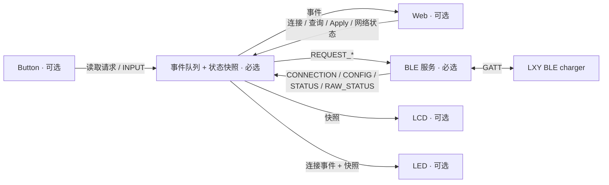

# 模块架构与事件契约

系统以 `charger_event_bus` 作为所有应用模块之间的通信边界。BLE 是必选服务；LCD、Button、LED、Web 可分别移除。公共状态来自总线快照，可选模块不读取 `LXYCharger` 对象，也不读取其他可选模块的实体。



## 组件职责

| 模块 | 拥有的状态与资源 | 依赖 |
|---|---|---|
| `charger_event_bus` | 有界事件队列、订阅者、请求 ID、公共快照 | ESPHome 主循环；可原生测试的 core 不依赖 ESPHome |
| `lxy_charger` | BLE/GATT 连接、特征句柄、协议解码、查询与设置事务 | BLE client + bus |
| `charger_web` | 网页实体、目标值草稿、用户操作适配 | bus + ESPHome 实体类型 |
| Web YAML | Wi-Fi、网页资源、配网、网络地址事件 | 可选 Web 模块 |
| LCD YAML | AXP192 屏幕电源、SPI、ST7789、字体、显示布局 | bus.snapshot() + 自身硬件 |
| Button YAML | GPIO37/39 去抖与输入 | bus.request()/publish() + 自身硬件 |
| LED YAML | GPIO10 active-low 输出 | bus 的 CONNECTION 事件和归一化快照 |

硬件初始化只发生在所属包被包含时。LCD 的 AXP192 操作只设置屏幕 LDO 电压和使能位，保留其他电源及电池充电寄存器。删除 LCD 包也删除字体和显示驱动依赖。原始 M5StickC Plus 的引脚、电源和面板参数来自 [M5Stack 官方说明](https://docs.m5stack.com/en/core/m5stickc_plus)、[AXP192 初始化源码](https://github.com/m5stack/M5StickC-Plus/blob/master/src/AXP192.cpp)及 [M5GFX 面板配置](https://github.com/m5stack/M5GFX/blob/master/src/M5GFX.cpp)。

### 既有 Plus 1.1 项目的参考范围

同作者的 [chinawrj/m5stickplus1.1](https://github.com/chinawrj/m5stickplus1.1) 提供这块板的 ESP-IDF 驱动参考。逐项核对的是源码，而不只是 README 表格：

- [`red_led.h`](https://github.com/chinawrj/m5stickplus1.1/blob/main/main/red_led.h) 使用 GPIO10、ON=0/OFF=1，与官方原理图及本项目的 active-low 配置一致。参考项目 README 的 “Active high” 表格项与其源码不一致，本项目按源码和原理图配置。
- [`st7789_lcd.c`](https://github.com/chinawrj/m5stickplus1.1/blob/main/main/st7789_lcd.c) 使用 BGR、135×240、offset 52/40，并在 SPI 初始化前启用 LCD 电源与背光。本项目沿用这些板级参数，通过 ESPHome `mipi_spi` 显示横向 240×135 页面。
- [`axp192.c`](https://github.com/chinawrj/m5stickplus1.1/blob/main/main/axp192.c) 分开管理显示逻辑和背光。本项目保持最小屏幕初始化；两路使用 M5Stack 原始 Plus 初始化的 3.0 V，不启用参考项目中的其他外设电源。
- 安装顺序沿用确认串口、烧录、115200 波特率查看日志；具体命令使用 ESPHome CLI。该参考项目的原生 `idf.py` 构建和 1.5 MB 应用分区不直接套用于本工程。

这里只参考板级模式，没有引入其 LVGL/ESP-NOW 业务代码；本工程的模块通信仍全部经过事件总线。

## 事件与数据

类型定义位于 [`event_core.h`](../components/charger_event_bus/event_core.h)，命名空间为 `esphome::charger_event_bus`。

| 事件 | 典型生产者 | 消费方与效果 |
|---|---|---|
| `REQUEST_CONNECT` | Web / 新增控制适配器 | BLE 启用连接 |
| `REQUEST_DISCONNECT` | Web / 新增控制适配器 | BLE 禁用连接；不是关闭充电输出 |
| `REQUEST_READ_CONFIG` | Web、Button A | BLE 发起只读查询 |
| `REQUEST_APPLY_CONFIG` | Web | BLE 验证并提交事件中的两项设定值 |
| `CONNECTION` | BLE | 更新连接、就绪、忙碌状态；未就绪时使设定值失效 |
| `CONFIG` | BLE | 更新设定值；不会自行把连接标成就绪 |
| `STATUS` | BLE | 更新请求状态、结果与忙碌标记 |
| `RAW_STATUS` | BLE | 保留尚未解码的原始状态帧；不推断测量值 |
| `INPUT` | Button B、Web | 输入动作或草稿反馈；不覆盖 BLE 事务忙碌状态，也不触发设置 |
| `NETWORK_STATE` | 可选网络模块 | 更新或清空 IP 地址 |

`Event` 含类型、`request_id`、来源 `source`、连接状态、设定值、`Result` 和文本 `message`。`Snapshot` 保存公共状态；LCD 只读取这个快照。网络事件使用 `connected` 表示网络可用，`message` 承载地址；无网络模块时 `ip_address` 为空。

`request(type, source, voltage, current)` 只接受四类 `REQUEST_*`，成功入队后返回非零关联 ID；入队失败或 ID 耗尽返回 `0`。启动与未关联的报告使用 ID `0`。BLE 在请求对应的 `CONFIG`、`STATUS` 等事件中保留关联 ID。这个 ID 只用于控制器内部事件关联，不是新增到充电器协议的事务字段。

`Result` 的含义：

| 值 | 含义 |
|---|---|
| `INFO` | 状态说明或本地草稿更新 |
| `ACCEPTED` | 请求开始处理，尚未完成设备结果确认 |
| `VERIFIED` | 对应操作的确认流程完成；Apply 需要新的参数回读匹配 |
| `REJECTED` | 未满足就绪、空闲或参数要求，请求被拒绝 |
| `FAILED` | 查询或确认失败，包括明确回读不匹配 |
| `UNKNOWN` | 请求可能已经到达设备，但无法确认最终结果 |

## 队列与生命周期

事件先入 FIFO 队列，再由 ESPHome 主循环分发。默认容量 32，最多 16 个订阅者，每次分发最多 8 个事件。发布不会同步调用订阅者；订阅者产生的新事件排在队尾，嵌套分发不会递归执行。所有访问应在应用主循环上下文进行；core 本身不提供跨线程锁。

分发时先归约快照，再通知订阅者。`CONNECTION` 将 `ready` 和 `busy` 约束到已连接状态；未就绪时电压、电流设为 `NaN`。断线后迟到的 `CONFIG` 不会重新显示旧数值。请求和 `INPUT` 不直接修改充电器状态，实际状态由 BLE 服务报告。

发布方必须检查入队结果。原始诊断帧允许丢弃并记录日志；BLE 的关键连接或结果事件入队失败时，会停用连接并安排失效报告，不重放设置命令。可选适配器不应把入队失败显示为设备操作成功。

后台 `04` 状态查询也占用 BLE 请求通道。等待 `84` 时，可保留一笔带关联 ID 和参数快照的查询或 Apply 请求，收到回复后才发送；后续请求被拒绝。后台轮询本身不使网页草稿变成忙碌状态，保留用户请求后才报告忙碌。超时或断线会清除尚未发送的请求，重连后不会重放。

## 一次 Apply 如何完成

1. Web 修改草稿，仅更新本地值与状态说明，不发布 BLE 设置请求。
2. 显式 Apply 发布一个 `REQUEST_APPLY_CONFIG`，同时携带电压、电流。
3. BLE 独立检查连接就绪、没有未完成事务、两项参数均在已验证范围内且步长为 0.1。
4. BLE 只发送一次 `03` 设置帧；等待 `83` 返回的两项参数与请求匹配。
5. 收到匹配回显后，另发 `02/01` 查询，用新的 `82` 配置回读确认。只有回读匹配才报告 `VERIFIED`。
6. 超时、断线或异常时清除事务状态并报告失败/未知；重连会重新读取，但不会重放 Apply。

电压、电流是 big-endian 16 位整数，以十分之一为单位；帧以 `5E 5E` 开始，长度与 XOR 校验由协议层验证。流式解码支持通知分段和多帧合并。`83` 没有独立成功码；本流程也不证明断电保存、输出开关或实际输出测量结果。

网页草稿在 BLE 重连后保持；控制器重启后从首次有效回读初始化。UI 就绪检查只是第一道检查，BLE 服务始终独立验证请求，避免新的适配器绕过约束。

## 添加模块

可显示的模块订阅事件或读取快照；可操作的模块通过 `request()` 发布意图。禁止直接引用 `LXYCharger`、自行写 GATT，或借用另一个可选模块的实体。请求发布示例：

```cpp
using esphome::charger_event_bus::EventType;
const uint32_t id = bus->request(EventType::REQUEST_READ_CONFIG, "my_module");
if (id == 0) {
  // 未入队；不能当作充电器已接收。
}
```

观察者可在 CONNECTION 回调中读取 `bus->snapshot().ready`，使用已经归一化的状态。新增模块自己的 GPIO、实体与资源都应随其 package 一起加入或移除；不要在必选核心留下对它们的 ID 引用。

## 组合与验证边界

必选核心始终包含 BLE 和 bus，四个可选项分别为 LCD、Button、LED、Web，共 16 种组合。矩阵以 M5StickC Plus 为完整硬件基准，验证每个组合的 YAML 和实际固件编译；ATOMS3U 另做无屏配置编译。

原生 `tests/test_event_core.py` 使用模块替身检查 16 种组合的事件流、关联 ID、读回快照、断线失效、重连不重放，以及队列边界。这些是软件边界测试，不能替代真实 ESPHome 适配器编译，也不能验证 BLE 射频、屏幕朝向或实体按键。

实机验证状态以[验证记录](verification.md)为准；ATOMS3U **尚未实机验证**。没有声明所有 16 个组合都已逐个刷机。具体构建结果应与源码提交及测试输出对应。
