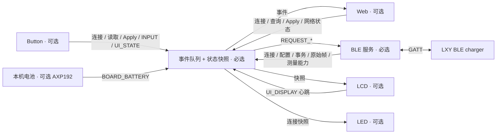

# 模块架构与事件契约

系统以 `charger_event_bus` 作为所有应用模块之间的通信边界。BLE 是必选服务；LCD、Button、LED、Web、Battery 可分别移除。公共状态来自总线快照，可选模块不读取 `LXYCharger` 对象，也不读取其他可选模块的实体。



## 组件职责

| 模块 | 拥有的状态与资源 | 依赖 |
|---|---|---|
| `charger_event_bus` | 有界事件队列、订阅者、请求 ID、公共快照 | ESPHome 主循环；可原生测试的 core 不依赖 ESPHome |
| `lxy_charger` | BLE/GATT 连接、特征句柄、协议解码、查询与设置事务 | BLE client + bus |
| `charger_web` | 网页实体、目标值草稿、用户操作适配 | bus + ESPHome 实体类型 |
| Web YAML | Wi-Fi、网页资源、配网、网络地址事件 | 可选 Web 模块 |
| `charger_display` + LCD YAML | 纯 C++ 布局、AXP192、SPI、ST7789、字体、显示心跳 | bus.snapshot()/publish() + 自身硬件 |
| `charger_buttons` + Button YAML | GPIO37/39、去抖边沿、草稿/确认状态机 | bus.request()/publish() + 自身硬件 |
| `charger_indicator` + LED YAML | GPIO10 active-low 连接指示灯 | bus 的 `connected/connection_enabled` 快照 |

硬件初始化只发生在所属包被包含时。LCD 的 AXP192 操作只设置屏幕 LDO 电压和使能位，保留其他电源及电池充电寄存器。删除 LCD 包也删除字体和显示驱动依赖。原始 M5StickC Plus 的引脚、电源和面板参数来自 [M5Stack 官方说明](https://docs.m5stack.com/en/core/m5stickc_plus)、[AXP192 初始化源码](https://github.com/m5stack/M5StickC-Plus/blob/master/src/AXP192.cpp)及 [M5GFX 面板配置](https://github.com/m5stack/M5GFX/blob/master/src/M5GFX.cpp)。

### 既有 Plus 1.1 项目的参考范围

同作者的 [chinawrj/m5stickplus1.1](https://github.com/chinawrj/m5stickplus1.1) 提供这块板的 ESP-IDF 驱动参考。逐项核对的是源码，而不只是 README 表格：

- [`red_led.h`](https://github.com/chinawrj/m5stickplus1.1/blob/main/main/red_led.h) 使用 GPIO10、ON=0/OFF=1，与官方原理图及本项目的 active-low 配置一致。参考项目 README 的 “Active high” 表格项与其源码不一致，本项目按源码和原理图配置。
- [`st7789_lcd.c`](https://github.com/chinawrj/m5stickplus1.1/blob/main/main/st7789_lcd.c) 使用 BGR、135×240、offset 52/40，并在 SPI 初始化前启用 LCD 电源与背光。本项目沿用这些板级参数，通过 ESPHome `mipi_spi` 显示横向 240×135 页面。
- [`axp192.c`](https://github.com/chinawrj/m5stickplus1.1/blob/main/main/axp192.c) 分开管理显示逻辑和背光。本项目保持最小屏幕初始化；两路使用 M5Stack 原始 Plus 初始化的 3.0 V，不启用参考项目中的其他外设电源。
- 安装顺序沿用确认串口、烧录、115200 波特率查看日志；具体命令使用 ESPHome CLI。该参考项目的原生 `idf.py` 构建和 1.5 MB 应用分区不直接套用于本工程。

这里只参考板级模式，没有引入其 LVGL/ESP-NOW 业务代码。本项目使用 ESPHome `mipi_spi` 与纯 C++ 标签布局，不使用 LVGL；模块通信全部经过事件总线。

## 事件与数据

类型定义位于 [`event_core.h`](../components/charger_event_bus/event_core.h)，命名空间为 `esphome::charger_event_bus`。

| 事件 | 典型生产者 | 消费方与效果 |
|---|---|---|
| `REQUEST_CONNECT` | Web、离线 Button B | BLE 启用连接 |
| `REQUEST_DISCONNECT` | Web / 新增控制适配器 | BLE 禁用连接；不是关闭充电输出 |
| `REQUEST_READ_CONFIG` | Web、Button B | BLE 发起只读查询 |
| `REQUEST_APPLY_CONFIG` | Web、Button 确认 | BLE 验证并提交事件中的两项设定值 |
| `CONNECTION` | BLE | 分别更新连接启用、实际连接、协议就绪与忙碌；未就绪时使设定值失效 |
| `CONFIG` | BLE | 更新设定值；不会自行把连接标成就绪 |
| `STATUS` | BLE | 更新请求状态、结果与忙碌标记 |
| `RAW_STATUS` | BLE | 保留尚未解码的原始状态帧；不推断测量值 |
| `INPUT` | Button GPIO、Web | 输入动作或草稿反馈；不覆盖 BLE 事务忙碌状态，本身不直接写设备 |
| `NETWORK_STATE` | 可选网络模块 | 更新或清空 IP 地址 |
| `TELEMETRY_CAPABILITY` | BLE / 经验证的测量适配器 | 显式声明 `telemetry_supported`、通道位掩码与映射置信度；关闭能力或更换通道时清除测量值 |
| `TELEMETRY` | 经验证的测量适配器 | 只有已连接且声明支持时才接受有效、有限的 `output_voltage/current`；不改配置 |
| `UI_DISPLAY` | LCD | 每次绘制发布可用性；Button 在 3 秒无心跳后禁止编辑/提交 |
| `UI_CONTROLS` | Button | 声明本地按键可用性；LCD-only 不提示不存在的按键 |
| `UI_STATE` | Button | 本地模式、草稿、typed notice/hold 与反馈时间；不改 BLE ready/busy/配置或事务 ID |

`Event` 含类型、`request_id`、来源 `source`、连接状态、设定值、`Result` 和文本 `message`。`Snapshot` 保存公共状态；LCD 只读取这个快照。网络事件使用 `connected` 表示网络可用，`message` 承载地址；无网络模块时 `ip_address` 为空。

`request(type, source, voltage, current)` 只接受四类 `REQUEST_*`，成功入队后返回非零关联 ID；入队失败或 ID 耗尽返回 `0`。启动与未关联的报告使用 ID `0`。BLE 在请求对应的 `CONFIG`、`STATUS` 等事件中保留关联 ID。这个 ID 只用于控制器内部事件关联，不是新增到充电器协议的事务字段。

`Result` 的含义：

| 值 | 含义 |
|---|---|
| `INFO` | 状态说明或本地草稿更新 |
| `ACCEPTED` | 请求开始处理，尚未完成设备结果确认 |
| `VERIFIED` | 对应操作的确认流程完成；Apply 需要新的参数回读匹配 |
| `REJECTED` | 未满足就绪、空闲或参数要求，请求被拒绝 |
| `FAILED` | 查询或确认失败，包括明确回读不匹配 |
| `UNKNOWN` | 请求可能已经到达设备，但无法确认最终结果 |

### 连接、配置与测量是独立状态

`connection_enabled` 表示本机 BLE client 是否启用了连接；`connected` 表示实际链路是否存在。自动连接启用但尚未连上时，两者分别为 true/false。`ready` 表示 GATT 通知可用且已完成配置回读；`busy` 表示前台事务正在处理。连接成功、协议就绪和读到实时测量不能互相替代。

`voltage/current` 始终是配置设定值。实际输出使用独立的 `output_voltage/output_current`。`TELEMETRY_CAPABILITY` 必须先声明支持，随后有效的 `TELEMETRY` 才能提供测量；声明能力本身不生成样本，也不刷新样本时间。关闭能力或断连会清空有效测量，重新连接不会恢复旧样本。`RAW_STATUS` 事件只更新原始帧和接收时间，不能绕过能力门槛；BLE 解析器另行发布类型化 `TELEMETRY`。

**当前只解析推定的电压通道。** BLE 启动时发布 `telemetry_supported=true`、`telemetry_channels=1`、`telemetry_inferred=true`。通道位 1 为电压，位 2 为电流；有效样本必须包含所有已声明通道的有限数值，未声明通道强制为 `NaN`。电压来自 `84` DATA[3:5] 大端整数除以 10，LCD 标注“电压待核”，Web 状态注明 inferred。电流解析按用户要求暂缓；绝不因空载推断为零。协议依据与未核验范围见 [协议说明](protocol.md)。

`snapshot.output_state(now)` 按下列顺序分类。这是测量数据的可用性，不是充电输出开关状态：

| `OutputState` | 判定条件 |
|---|---|
| `DISCONNECTED` | 实际 BLE 链路未连接 |
| `LIVE` | 已声明支持，当前样本有效且年龄小于 6000 ms |
| `INITIALIZING` | 无有效新样本，协议尚未就绪 |
| `UNSUPPORTED` | 协议已就绪，但未声明测量解码支持 |
| `WAITING` | 支持测量，但当前连接尚未收到首个样本 |
| `STALE` | 已收到有效样本，但年龄达到或超过 6000 ms |
| `INVALID` | 已收到样本，但它被标记无效或数值不是有限数 |

消费者统一使用 `output_state(now)` 或 `telemetry_fresh(now)`，不能只检查缓存数值。时间为本次启动的毫秒计数，使用无符号减法处理计数回绕。

### 本地界面的类型与时间

`UiMode` 分开表示 `VIEW`、`EDIT`、`CONFIRM`、`SUBMITTING`、`REFRESHING`、`CONNECTING`、`HELP`、`METER`。刷新和连接不会显示成正在提交草稿。`UiNotice` 区分 `APPLIED`、`REFRESHED`、`CONNECTED`、`CONNECT_FAILED`，以及取消、限幅、未就绪、忙、配置变化、超时和结果未知等反馈。按钮只用自己的 pending 请求 ID 与种类解释 `STATUS`，后台自动读回不会被当成本地操作成功。

`UiHold` 是“松开后执行”的提示。达到 800 ms 只更新提示，不发送请求；有效长按在 800–5000 ms 松开时执行。超过 5 秒显示 `RELEASE`，松开不执行。帮助页、等待期间和中途作废的手势不能附带产生一次连接、刷新或设置。

Button 仅在本地 UI 改变时发布 `UI_STATE.sampled_at`，总线将它保存为 `ui_updated_at`。后台 `STATUS` 和 LCD 心跳本身不续期本地反馈。当前正常页的普通反馈显示 3 秒；`FAILED`、`UNKNOWN`、`CONNECT_FAILED` 显示 6 秒。快照仍保留最后的 notice；提示何时隐去由显示层决定，连接/刷新/忙状态可以优先显示。

## 队列与生命周期

事件先入 FIFO 队列，再由 ESPHome 主循环分发。默认容量 32，最多 16 个订阅者，每次分发最多 8 个事件。发布不会同步调用订阅者；订阅者产生的新事件排在队尾，嵌套分发不会递归执行。所有访问应在应用主循环上下文进行；core 本身不提供跨线程锁。

分发时先归约快照，再通知订阅者。`CONNECTION` 将 `ready` 和 `busy` 约束到已连接状态；未就绪时电压、电流设为 `NaN`。断线后迟到的 `CONFIG` 不会重新显示旧数值。请求和 `INPUT` 不直接修改充电器状态，实际状态由 BLE 服务报告。

发布方必须检查入队结果。原始诊断帧允许丢弃并记录日志；BLE 的关键连接或结果事件入队失败时，会停用连接并安排失效报告，不重放设置命令。可选适配器不应把入队失败显示为设备操作成功。

后台 `04` 状态查询也占用 BLE 请求通道。等待 `84` 时，可保留一笔带关联 ID 和参数快照的查询或 Apply 请求，收到回复后才发送；后续请求被拒绝。后台轮询本身不使网页草稿变成忙碌状态，保留用户请求后才报告忙碌。超时或断线会清除尚未发送的请求，重连后不会重放。

## 一次 Apply 如何完成

1. Web 修改草稿，仅更新本地值与状态说明，不发布 BLE 设置请求。
2. 显式 Apply 发布一个 `REQUEST_APPLY_CONFIG`，同时携带电压、电流。
3. BLE 独立检查连接就绪、没有未完成事务、两项参数均在配置范围内且步长为 0.1（电压 50–93 V 依据用户提供的铭牌，电流按用户明确要求设置为 1–10 A；报告的铭牌电流为 3–10 A）。
4. BLE 只发送一次 `03` 设置帧；等待 `83` 返回的两项参数与请求匹配。
5. 收到匹配回显后，另发 `02/01` 查询，用新的 `82` 配置回读确认。只有回读匹配才报告 `VERIFIED`。
6. 超时、断线或异常时清除事务状态并报告失败/未知；重连会重新读取，但不会重放 Apply。

电压、电流是 big-endian 16 位整数，以十分之一为单位；帧以 `5E 5E` 开始，长度与 XOR 校验由协议层验证。流式解码支持通知分段和多帧合并。`83` 没有独立成功码；本流程也不证明断电保存、输出开关或实际输出测量结果。

网页草稿在 BLE 重连后保持；控制器重启后从首次有效回读初始化。UI 就绪检查只是第一道检查，BLE 服务始终独立验证请求，避免新的适配器绕过约束。

## 添加模块

可显示的模块订阅事件或读取快照；可操作的模块通过 `request()` 发布意图。禁止直接引用 `LXYCharger`、自行写 GATT，或借用另一个可选模块的实体。请求发布示例：

```cpp
using esphome::charger_event_bus::EventType;
const uint32_t id = bus->request(EventType::REQUEST_READ_CONFIG, "my_module");
if (id == 0) {
  // 未入队；不能当作充电器已接收。
}
```

观察者可在 CONNECTION 回调中读取 `bus->snapshot().ready`，使用已经归一化的状态。新增模块自己的 GPIO、实体与资源都应随其 package 一起加入或移除；不要在必选核心留下对它们的 ID 引用。

## 组合与验证边界

必选核心始终包含 BLE 和 bus，五个可选项分别为 LCD、Button、LED、Web、Battery，共 32 种组合。矩阵以 M5StickC Plus 为完整硬件基准，验证每个组合的 YAML 和实际固件编译；ATOMS3U 另做无屏配置编译。

原生 `tests/test_event_core.py` 使用模块替身检查 32 种组合的事件流、关联 ID、读回快照、断线失效、重连不重放，以及队列边界。这些是软件边界测试，不能替代真实 ESPHome 适配器编译，也不能验证 BLE 射频、屏幕朝向或实体按键。

实机验证状态以[验证记录](verification.md)为准；ATOMS3U **尚未实机验证**。没有声明所有 32 个组合都已逐个刷机。具体构建结果应与源码提交及测试输出对应。

## LCD、按钮与 LED 的独立性

正常页大字只读取受能力和时效检查保护的实际测量；小字“设定”只读取 `CONFIG`。没有有效测量时显示具体原因，例如初始化、未解码、等待首样本或过期，而不会把 `--.-` 暗示成 BLE 未连接。顶部链路文字直接使用 `connected/connection_enabled`。当前电压来自推定的映射，故已就绪设备显示“电压待核”，电流保持未知并注明暂缓。

按钮只通过事件获知 LCD 存在，不引用 display ID。LCD 的 250 ms 绘制回调根据电源初始化和组件状态发布 `UI_DISPLAY`；按钮按接收时间实施 3 秒心跳失效检查。没有 LCD 时仍可选择字段、连接和只读刷新，但不能编辑、提交或进入不可见的帮助页。

A 短按选择、长按进入编辑；编辑时 A/B 减/加 0.1，A 长按进入确认，再次 A 长按才提交，B 取消。两项草稿来自同一次配置快照。B 在浏览页短按时：就绪且空闲则刷新；已断开且连接未启用则只请求一次连接；连接已启用或正在初始化则提示等待。浏览页长 B 打开 `HELP`，其中短按 A 或 B 只返回并消费手势，长按无动作，30 秒无操作返回。

编辑无操作 30 秒、配置基线变化、失联、外部事务忙或显示失效会取消未提交草稿；双键和丢边沿也会抑制整个手势。`buttons_gpio` 的 `INPUT.request_id` 专用于共享的 uint32 GPIO 边沿序号，支持回绕，不作为 BLE 请求 ID。已提交请求只跟踪结果，不自动重发。

板载 LED 是固定红色，只表示连接：实际 `connected=true` 优先常亮；否则 `connection_enabled=true` 时 500 ms 亮/500 ms 灭；两者均 false 时熄灭。GATT 初始化、事务、错误和未解码测量都不改变已连接时的常亮，不使用事务闪码。实现只读取连接快照、非阻塞计算电平；详见 [LED 组件](../components/charger_indicator/README.md)。LCD、按键与 LED 均不依赖 Web/Wi-Fi。


### 待机仪表事件

Button 在 VIEW 页无输入边沿 15 秒、LCD 心跳可用且没有请求或按键占用时，发布 `UI_STATE` 切换到 `METER`。LCD 只读取快照渲染 V/A/W，不引用 Button 对象。第一次按键立即返回 VIEW 并消费整个手势，避免唤醒兼作编辑或提交。只有 LCD 的组合保留 VIEW；没有 LCD 的组合不进入仪表页。功率仅取同一份有效、未过期的实时 V/A 样本相乘；单电压解码时电流与功率均未知。


### 本机电池事件

`m5stick_battery` 独立读取 AXP192，每 2 秒发布 `BOARD_BATTERY`，包含电池存在、采样有效性、电压及充/放电两个 mA 通道。总线归约出带符号净电流（充入减放出），以独立时间戳在 6 秒后过期。BLE 连接事件不清除本机电池读数，本机电池事件也不改变 BLE 状态、设定或外接输出数据。LCD 的应用数据仍全部来自总线；仅底部主页行消费本机电池快照，专属功率页不受影响。LCD 和 Battery 的 I2C 依赖通过同一个映射式 package 合并，只有 Battery、只有 LCD 或两者都启用均有效。

### 五分钟背光空闲

Button 使用独立于 15 秒功率页的 300000 ms 计时，经 `UI_STATE.ui_backlight_on` 请求背光开关。LCD 从快照读取请求，只有它操作 AXP192 的 LDO2（0x12 bit 2），读改写并校验，保留 LCD 逻辑及其他电源。熄背光仍持续显示心跳、BLE 和采样。任意按键唤醒并吞掉整次手势；无 Button 则常亮。编辑/帮助/等待结果及按住按键不进入熄背光。

LED 同样消费总线中的空闲请求，将输出设置为零占空比，关闭常亮和连接闪烁；唤醒恢复实时 BLE 灯态。LED 不调用 LCD 或 Button 对象，ESP32 不进入深度睡眠。
